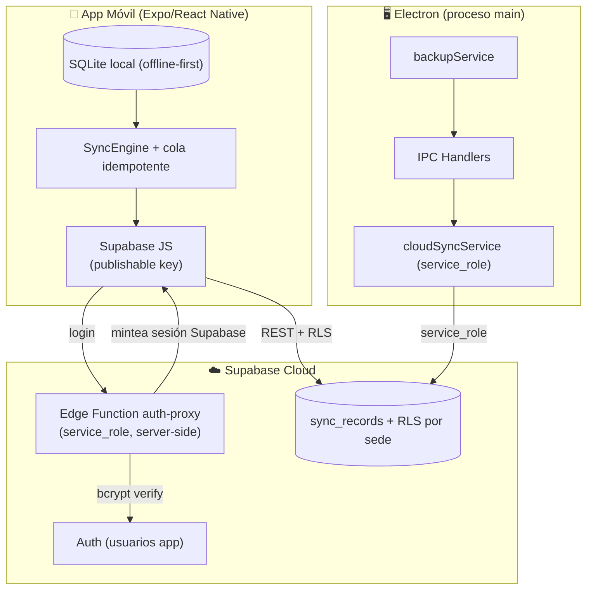

# Plan de Auditoría Integral y Optimización del Ecosistema Farmacia Control

## Descripción General
Este plan aborda de manera integral la auditoría técnica, corrección de errores funcionales, blindaje de seguridad y pulido UX/UI del ecosistema de **Farmacia Control** (escritorio Electron/React y móvil Expo/React Native), e incorpora la **conexión directa de la app móvil a Supabase** mediante la publishable key con RLS por usuario y sede.

> [!IMPORTANT]
> **Decisión de arquitectura tomada para este plan (2026-10-02):**
> La app móvil se conecta **directamente a Supabase**, sin depender de que el proceso main de Electron esté corriendo. Esto elimina la dependencia actual donde el login remoto exige `npm run dev` en el equipo de la sede.
>
> - El móvil usa `SUPABASE_PUBLISHABLE_KEY` (la antigua anon key), que es pública por diseño y puede vivir en el bundle.
> - La `service_role` **nunca** sale del proceso main de Electron. Solo la usan Electron y las Edge Functions de Supabase.
> - El acceso del móvil está gobernado por **RLS con alcance por `sede_id`**, no por lógica del cliente.

---

## Correcciones Aplicadas al Diagnóstico Original

Esta sección documenta qué se corrigió respecto de la versión previa de este plan, para que no se reintroduzcan los errores.

| Afirmación original | Estado | Corrección |
|---|---|---|
| `backupController.listar` sin `await` | **Válida** | Se mantiene. Confirmado en `backupController.js:11-17` y `:35-41`. |
| `colSpan=5` con 6 columnas | **Válida** | Se mantiene. Cosmético (`Respaldos.jsx:358`). |
| Rutas `/sync/push` y `/sync/pull` inexistentes | **Válida** | Se mantiene, pero el plan ahora especifica el contrato completo (ver Componente 1). |
| Faltan índices en `usuarios`, `movimientos_inventario`, `ordenes` | **Errónea** | Los tres índices propuestos ya existen o son inútiles. **Componente eliminado**; se sustituye por verificación con `EXPLAIN QUERY PLAN`. |
| `fs.copyFileSync` es inseguro en modo WAL | **Debil** | `crear()` ya ejecuta `wal_checkpoint(FULL)` antes de copiar. Se mantiene la mejora a `db.backup()`, pero por la razón correcta (ver Componente 2). |
| Falta manejar reapertura de la BD tras restaurar | **Incorrecta** | `ipcHandlers.js:259-268` ya hace `app.relaunch()`. No hay nada que abrir. |
| No existe ningún botón Cancelar | **Incorrecta** | `Inventario.jsx:158-173` y `Ordenes.jsx:213-216` ya tienen toggles `✕ Cerrar formulario`. Falta el botón *dentro* del formulario: es mejora de UX, no capacidad faltante. |
| Anchos de modal de 500 a 850px | **Imprecisa** | Valores reales: 500, 520, 640, 700, 720, 750px. No existen 550 ni 850. |
| Sincronizar `password_hash` a Supabase | **Rechazada** | Revertiría una decisión de seguridad deliberada. Ver Componente 4. |
| `node backend/server.js` arranca el servidor | **Incorrecta** | `server.js` solo exporta factories. La API vive en el main de Electron. |

---

## Hallazgos Verificados

### 1. Módulo de Respaldos

**Causa raíz confirmada.** `backupService.listar` (`backupService.js:52`) y `ultimoRespaldo` (`:204`) son `async`. El controlador devuelve un objeto literal `{ ok: true, data: <Promise> }`. Ese objeto **no es un *thenable***, así que `ipcMain.handle` no lo resuelve: Electron serializa la Promise como `{}` por structured clone. En `Respaldos.jsx:80` el estado se vuelve `{}` y `.map()` revienta.

**Segundo defecto encadenado, no detectado en la versión previa.** `better-sqlite3`'s `db.backup()` devuelve una Promise. Si `crear` pasa a `async` sin actualizar a sus consumidores:
- `backupController.crear` (`:19-25`) reproduce **exactamente el mismo bug** que se está arreglando.
- `verificarYEjecutarAutoBackup` (`backupService.js:304`) invoca `crear(null, true)` de forma síncrona y lee `res.nombre` en la línea 308.

Cualquier cambio a `crear` debe propagarse a ambos puntos o se intercambia un bug por otro.

### 2. Contrato de Sincronización Móvil

`backend/server.js:53` solo monta `/auth`. `SyncEngine.ts:222,309` llama `/sync/push` y `/sync/pull` y recibe 404. Sin embargo, **definir las rutas no basta**: el cliente tiene inconsistencias que harían que la sincronización nunca se aplicara, con independencia de lo que devuelva el servidor.

1. **Casing inconsistente en el resultado de push.** `SyncEngine.ts:234` busca `result.idempotency_key` (snake_case) pero el tipo `PushOperationResult` declara `idempotencyKey` (camelCase, `types/sync.ts:48`). Con la respuesta tipada, el `find` falla y **todos los ítems se descartan en silencio** por el `continue` de la línea 235. Fallo invisible.
2. **Contadores obligatorios.** `PushResult` (`types/sync.ts:40-45`) exige `results`, `syncedCount`, `failedCount`, `conflictCount`.
3. **Sin paginación real.** `PullResult` declara `cursor` y `hasMore`; `SyncEngine.pull` los ignora y fija `lastPullTimestamp` a `now()`. Con `pullLimit: 500`, todo lo que supere el primer lote **se pierde de forma permanente**.
4. **Nombres de tabla del pull que no coinciden con el SQLite móvil.** `ENTIDADES_SINCRONIZABLES` declara `notificaciones`, `mensajes`, `dispositivos`; las tablas reales son `notificaciones_locales`, `mensajes_locales` y `dispositivos` (`024`, `026`). El `INSERT OR REPLACE INTO "${tableName}"` de `applySingleChange` (`SyncEngine.ts:352`) interpola nombre de tabla **y** columnas controlados por el servidor, sin whitelist. **Las notificaciones quedan diferidas al Componente 7**; en esta fase esas tres entidades se excluyen de la whitelist.
5. **Errores tragados.** `applySingleChange` captura la excepción, hace `console.error` y continúa (`:355-358`). Un fallo de FK se pierde sin marcar el ítem ni notificar.

### 3. Sincronización de Usuarios y Credenciales

`cloudSyncService.js:15` excluye `password_hash` de `COLUMNAS_SENSIBLES` por decisión deliberada y documentada (`:13-14`). Al bajar, un usuario sin hash se descarta con `continue` (`:200-203`), lo que impide que usuarios nuevos created en una sede existan en otra.

### 4. Credenciales y `.env`

Solo existe `.env.example`. `supabaseConfig.js` no tiene fallbacks hardcoded, así que `syncHabilitado` queda en `false` sin configuración.

### 5. UX/UI

`.modal-overlay` usa `align-items: flex-start` (`global.css:1658`) y `.modal-card` fija `max-width: 650px` (`:1668`), con anchos inline dispersos entre 500 y 750px. No hay listener de tecla `Escape` en ningún componente.

---

## Arquitectura Objetivo



**Límites de confianza:**
- `service_role` existe únicamente en el main de Electron y en el entorno de la Edge Function. Nunca en el bundle móvil ni en el renderer.
- El bundle móvil solo lleva `SUPABASE_PUBLISHABLE_KEY` y `SUPABASE_URL`, que son públicos por diseño.
- La RLS de `sync_records` es la única barrera entre sedes. La app móvil no decide su alcance; Postgres lo impone.

---

## Componentes

### Componente 1: Sincronización Móvil Directa a Supabase

Este componente **reemplaza** el diseño original de montar rutas `/sync` en el Express de Electron. El móvil ya no consume `/api/v1/sync/*`.

#### [NEW] `supabase/migrations/002_rls_movil.sql`

Añadir columnas que hacen posible el aislamiento por sede, y políticas para el rol `authenticated`.

`sync_records` guarda el payload en `jsonb` sin columnas de pertenencia, así que RLS no puede filtrar por sede sobre el contenido. Se añaden columnas explícitas:

```sql
alter table public.sync_records
  add column if not exists sede_id      integer,
  add column if not exists usuario_id   integer,
  add column if not exists version      integer not null default 1,
  add column if not exists updated_at   timestamptz not null default now();

create index if not exists idx_sync_records_sede_updated
  on public.sync_records (sede_id, updated_at);
create index if not exists idx_sync_records_usuario
  on public.sync_records (usuario_id);
```

La tabla `public.perfiles` mapea el `auth.uid()` del usuario Supabase con su sede y rol, de modo que las políticas tengan contra qué evaluar:

```sql
create table if not exists public.perfiles (
  id         uuid primary key references auth.users (id) on delete cascade,
  usuario_id integer not null,
  sede_id    integer,
  rol        text   not null,
  created_at timestamptz not null default now()
);

alter table public.perfiles enable row level security;

-- Usuario solo lee su propia fila de perfil.
create policy "perfiles_select_propio"
  on public.perfiles for select to authenticated
  using (auth.uid() = id);
```

Las políticas sobre `sync_records` derivan el alcance del perfil del llamante. `SUPERADMIN` con `sede_id is null` ve todas las sedes; el resto solo la suya:

```sql
create policy "sync_records_select_movil"
  on public.sync_records for select to authenticated
  using (
    exists (
      select 1 from public.perfiles p
      where p.id = auth.uid()
        and ( p.sede_id is null or p.sede_id = sync_records.sede_id )
    )
  );

-- INSERT y UPDATE repiten la misma condición en with check; nunca puede
-- escribirse en el sync_records de otra sede. El borrado queda restringido a
-- service_role: el móvil sincroniza, no elimina historia compartida.
create policy "sync_records_insert_movil"
  on public.sync_records for insert to authenticated
  with check (
    exists (
      select 1 from public.perfiles p
      where p.id = auth.uid() and p.sede_id = sync_records.sede_id
    )
  );

create policy "sync_records_update_movil"
  on public.sync_records for update to authenticated
  using (
    exists (
      select 1 from public.perfiles p
      where p.id = auth.uid() and p.sede_id = sync_records.sede_id
    )
  )
  with check (
    exists (
      select 1 from public.perfiles p
      where p.id = auth.uid() and p.sede_id = sync_records.sede_id
    )
  );

grant select, insert, update on public.sync_records to authenticated;
```

> [!WARNING]
> Este es el punto de mayor riesgo del plan. Una política mal escrita filtra datos clínicos entre sedes. La verificación (Componente 6) incluye pruebas negativas explícitas: un usuario de la sede A **no debe** poder leer, escribir ni ver que existen filas de la sede B.

#### [NEW] `supabase/functions/auth-proxy/index.ts`

Puente de autenticación. El móvil no puede verificar bcrypt por sí mismo de forma confiable contra una tabla con RLS cerrada, y `service_role` no puede estar en el dispositivo. La función valida en el servidor y devuelve una sesión real de Supabase Auth.

- Lee `username` y `password` del body.
- Con `service_role` (variable de entorno del entorno de la función, nunca en el bundle) lee el registro de `usuarios` y verifica el bcrypt con coste 12.
- Rechaza usuarios `INACTIVO`, sin sede y sin rol válido, replicando las reglas de `authService.js`.
- Crea o reutiliza la entrada en `auth.users`, inserta el `perfiles` correspondiente y devuelve el par de tokens de Supabase.
- Registra los intentos fallidos con rate limiting por `username` e IP.

El móvil deja de hacer login contra `/auth/login` del Express, pero **conserva el fallback local** de `AuthService.loginLocal` (`AuthService.ts:116`), que ya funciona con el hash bcrypt sembrado en el SQLite del móvil. La app sigue siendo usable sin red.

#### [MODIFY] `mobile-app/src/constants/config.ts`

- Reemplazar la resolución de `API_URL_PRODUCCION` por configuración de Supabase leída de `EXPO_PUBLIC_SUPABASE_URL` y `EXPO_PUBLIC_SUPABASE_PUBLISHABLE_KEY`.
- `API_HOST_DEV` deja de ser necesario para sincronización; se conserva solo si queda algún consumidor de la API de escritorio.
- `ENTIDADES_SINCRONIZABLES` conserva `notificaciones`, `mensajes` y `dispositivos`, pero quedan **excluidas de la whitelist de sincronización** en esta fase. Ver Componente 7.

#### [MODIFY] `mobile-app/src/services/sync/SyncEngine.ts`

Contrato de `SupabaseSyncRepository` ( Sustituye la lógica HTTP directa):

- **Push:** cada operación se escribe en `sync_records` con `upsert` sobre `(table_name, record_id)`, usando `idempotency_key` como columna de deduplicación. Respuesta en **snake_case**, coherente con lo que el código ya consume en la línea 234: `{ idempotency_key, status, remote_id, error }`.
- **Whitelist estricta de entidades y columnas.** Ningún nombre de tabla o columna proveniente del servidor llega a una sentencia SQL sin pasar antes por una lista permitida derivada de `ORDEN_TABLAS_SINC`. Esto cierra la interpolación de `"${tableName}"` y `"${c}"` de `applySingleChange:347-353`.
- **Pull paginado por cursor.** Se itera mientras `has_more` sea verdadero, acumulando el `cursor` devuelto por cada lote. Nunca se fija `lastPullTimestamp` hasta haber drenado todos los lotes.
- **Errores no tragados.** Un cambio que falla al aplicarse marca el ítem como fallido en la cola y notifica; no se continúa en silencio.

#### [NEW] `mobile-app/src/services/sync/SupabaseSyncRepository.ts`
Implementación del acceso a `sync_records` con el cliente de Supabase, session obtained de `auth-proxy`, manejo de `401` vía refresh y respeto de RLS sin lógica de filtrado del lado cliente.

### Componente 2: Corrección del Módulo de Respaldos

#### [MODIFY] `backend/controllers/backupController.js`

Hacer `async` las funciones cuyo servicio es asíncrono, propagando los errores con el helper existente:

```javascript
async function listar(usuarioSesion, filtros) {
  try {
    const data = await backupService.listar(usuarioSesion, filtros);
    return { ok: true, data };
  } catch (err) {
    return manejarError(err);
  }
}

async function ultimoRespaldo(usuarioSesion, filtros) {
  try {
    const data = await backupService.ultimoRespaldo(usuarioSesion, filtros);
    return { ok: true, data };
  } catch (err) {
    return manejarError(err);
  }
}
```

#### [MODIFY] `backend/services/backupService.js`

Migrar la copia al API online de SQLite. El motivo correcto no es el WAL —`crear()` ya hace `wal_checkpoint(FULL)` en la línea 98— sino eliminar la ventana entre el checkpoint y el `copyFileSync`, durante la cual una escritura concurrente puede dejar el archivo inconsistente.

```javascript
async function crear(usuarioSesion, opciones = {}) {
  // ...misma validación y resolución de sede actual...
  await db.backup(destino);
  const integridad = validarIntegridad(destino);
  // ...
}
```

**Dos consumidores obligan a revisar el cambio:**
1. `backupController.crear` (`:19-25`) debe pasar a `async` con `await`. Si no, reintroduce el bug que este componente arregla.
2. `verificarYEjecutarAutoBackup` (`:304`) llama `crear(null, true)` de forma síncrona y lee `res.nombre` en la línea 308. Debe pasar a `async` y usar `await`, o encadenar con `.then()`. Además debe capturar el fallo sin abortar la escritura de `ultimo_backup_auto`, para no reprogramar el respaldo en bucle.

#### [MODIFY] `src/pages/Respaldos.jsx`
- `colSpan="5"` → `colSpan="6"`.
- Guardia `Array.isArray(respaldos)` antes de `.map()` y antes de `respaldos.length` en el encabezado.
- Feedback de progreso durante creación y restauración.

> Nota: la reapertura de la conexión tras restaurar **no** se implementa. `ipcHandlers.js:262-266` ya relanza la aplicación.

### Componente 3: Estado de la Sincronización de Usuarios entre Sedes

Se **descarta** la sincronización de `password_hash` a Supabase. Centralizar hashes bcrypt de todas las sedes en una tabla accesible con una sola clave convierte cualquier fuga de esa clave en compromiso de credenciales de toda la cadena, y revierte la decisión documentada en `cloudSyncService.js:13-14`.

**Estrategia adoptada:** el usuario se propaga entre sedes **sin credencial**, marcado para restablecimiento forzado.

#### [DONE] `backend/database/migrations/023_debe_restablecer_contrasena.js`

Añade `usuarios.debe_restablecer_contrasena INTEGER NOT NULL DEFAULT 0` con índice. El default 0 garantiza que ningún usuario sano cambie de estado. **Aplicada y verificada** en `data/farmacia.db` (7 usuarios, 0 con el flag activo).

#### [DONE] `mobile-app/src/services/database/migrations/028_debe_restablecer_contrasena.ts`

Contraparte en el SQLite móvil, con la misma columna e índice, registrada en `migrations/index.ts`. Se ejecuta automáticamente en el arranque según `PRAGMA user_version`.

#### [MODIFY] `backend/services/cloudSyncService.js`

```javascript
const COLUMNAS_SENSIBLES = new Set(['password_hash', 'password', 'token', 'secret']);

// Un usuario que llega de otra sede sin hash se inserta con una credencial
// aleatoria inservible y `debe_restablecer_contrasena = 1`. Se conserva el
// hash local si existe; nunca se sobrescribe una credencial vigente con una
// que venga de la nube.
```

- La fila se inserta en lugar de descartarse con `continue`. `password_hash` es `NOT NULL`, así que el hash aleatorio es obligatorio como placeholder.
- Al insertar desde la nube, forzar `debe_restablecer_contrasena = 1`.
- Si existe fila local con hash, se preserva el local y el flag queda en 0.
- La UI de usuarios debe ofrecer el restablecimiento cuando el flag está activo.

### Componente 4: Rendimiento SQLite

El componente de índices de la versión previa **se elimina**: los tres índices propuestos ya existen o no aportan nada.

- `idx_ordenes_sede_estado_fecha` ya existe como `idx_ordenes_sede_estado` (`009_indices_optimizacion.js:13`).
- `idx_usuarios_username_estado` es inútil: `username` es `UNIQUE` (`001_init.js:23`) y ya tiene índice implícito; un compuesto con `username` como columna líder no sirve para filtrar por `estado`.
- `idx_movimientos_sede_fecha` es marginal frente a `idx_movimientos_sede` + `idx_movimientos_fecha` (`007:26-27`) y `idx_mov_inv_fecha_tipo` (`009:5`).
- El índice propuesto sobre `sync_queue` apunta a una tabla **inexistente en el esquema de escritorio**; esa tabla solo existe en el SQLite móvil.

En su lugar, medir antes de indexar:

```sql
EXPLAIN QUERY PLAN
SELECT * FROM movimientos_inventario
WHERE sede_id = ? AND fecha >= ? ORDER BY fecha DESC LIMIT 50;

PRAGMA integrity_check;
PRAGMA foreign_key_check;
```

Solo se crea una migración nueva (`023_indices_*.js`, siguiendo la convención numerada del proyecto) si el plan de ejecución muestra un barrido de tabla no cubierto por índices existentes. **No se escribe SQL de índices en `backend/database/connection.js`.**

### Componente 5: UX de Formularios y Modales

#### [MODIFY] `src/components/MedicamentoForm.jsx`, `LoteForm.jsx`, `OrdenForm.jsx`
Añadir prop `onCancelar` y botón `Cancelar` con `type="button"` junto al de envío. Conectar en `Inventario.jsx` y `Ordenes.jsx` a `setMostrarFormMed(false)`, `setMostrarFormLote(false)` y `setMostrarFormOrden(false)`.

> Estos formularios ya se repliegan con el toggle `✕ Cerrar formulario` de la cabecera. El botón interno es redundancia deliberada de seguridad: una acción destructiva visible junto al envío, para quien ya está mirando el formulario.

#### [MODIFY] `src/styles/global.css`
- `.modal-overlay`: `align-items: center` con `padding` que preserve el desplazamiento cuando el modal excede el alto disponible.
- Variantes de tamaño que sustituyen a los anchos inline dispersos: `.modal-sm` (460px), `.modal-md` (620px), `.modal-lg` (880px).
- Listener global de `Escape` para cerrar el modal abierto.
- Unificar `.modal-close-x` con tooltip y roles de accesibilidad.

### Componente 6: Verificación

#### Pruebas automatizadas

**`tests/ipc/ipc_handlers.test.js`** (extender, no crear suite nueva)
- `backupController.listar` resuelve un `Array` real y serializable, no un objeto vacío.
- `backupController.crear` devuelve el objeto con `nombre` tras migrar a `db.backup()`.
- `verificarYEjecutarAutoBackup` completa un ciclo sin leer `res.nombre` de una Promise.

**`tests/sync-offline/offline_sync.test.js`** (extender)
- Un lote de operaciones con `idempotency_key` repetida produce una sola escritura.
- El pull pagina por cursor y drena todos los lotes antes de fijar `lastPullTimestamp`.
- Una entidad fuera de la whitelist se rechaza sin llegar a la capa SQL.
- Un cambio con FK inválida marca el ítem fallido en lugar de descartarse en silencio.

**RLS — pruebas negativas obligatorias**
- Usuario de la sede A **no** puede leer filas de la sede B.
- **No** puede insertar ni actualizar en `sync_records` de otra sede.
- Un `SUPERADMIN` ve todas las sedes; un usuario de sede no ve las ajenas.
- El rol `anon` sin sesión no lee nada (la tabla sigue revocada para `anon`).

#### Verificación manual

1. **Respaldos:** abrir *Copias de Seguridad y Respaldos*; la lista carga sin errores de consola. Crear un respaldo manual y confirmar el `.db` en `backups/` y su aparición en la tabla. Confirmar que `data/backups/` no contiene archivos con integridad rota.
2. **Botones y modales:** probar *Cancelar* en Medicamento, Lote, Orden, Despacho, Cancelar Orden, Baja de Lote y Usuario. Con un modal abierto, `Escape` debe cerrarlo.
3. **Móvil → Supabase:**
   - Login con la Edge Function activa. Verificar que el token devuelto es de Supabase Auth, no un token `local_` del fallback.
   - Con la red caída, confirmar que el login local sigue funcionando.
   - Sincronizar desde el móvil y verificar en Supabase que las filas quedan con `sede_id` y `usuario_id` correctos.
   - Con un usuario de otra sede, confirmar que el pull **no** devuelve datos ajenos.

---

## Componente 7: Sistema de Notificaciones (Escritorio y Móvil)

> [!NOTE]
> **Fase diferida por decisión del usuario (2026-10-02).** Se implementa al final, una vezstablecidos los componentes 1-6. Durante las fases anteriores, `notificaciones`, `mensajes` y `dispositivos` quedan **excluidos de la whitelist de sincronización** y no participan del pull.

El objetivo es un sistema de notificaciones en ambas plataformas sobre los eventos que ya genera el dominio.

#### Eventos a notificar

| Evento | Origen | Destinatario |
|---|---|---|
| Orden creada / cancelada / despachada | `ordenService`, `despachoService` | Usuario creador + admins de la sede |
| Solicitud de baja de lote aprobada o rechazada | `eliminacionService` | Solicitante |
| Solicitud de intercambio recibida | `intercambioService` | Admin de la sede destino |
| Lote por vencer (30, 15, 7 días) | `inventarioService` | Admins de la sede |
| Actualización de catálogo CUM | `catalogoCumService` | Admins y superadmin |
| Restablecimiento de contraseña completado | `usuarioService` | Usuario afectado |

#### [NEW] Esquema de notificaciones

La app móvil ya tiene `notificaciones_locales` y `mensajes_locales` (`024`). El escritorio no tiene tabla propia. El modelo común es:

```
notificaciones (
  id, usuario_id, sede_id, modulo, tipo,
  titulo, cuerpo, datos jsonb,
  leida (0|1), created_at, leida_at
)
```

Debe existir en ambos lados con el mismo nombre de tabla, para que `applySingleChange` pueda resolver la entidad sin un mapeo especial.

#### [NEW] Módulo de notificaciones

- **Escritorio (renderer):** panel de notificaciones con contador, marca de leídas, agrupación por día. Solo lectura desde el renderer vía IPC; la escritura ocurre en el servicio.
- **Móvil:** notificaciones locales vía `notificationService` (ya existe `expo-notifications`), disparadas al aplicar el pull. El usuario ya tiene `notifyOnSyncComplete` y `notifyOnConflict` en `SyncEngine`.
- **Sincronización:** `notificaciones` entra en `ORDEN_TABLAS_SINC` y en la whitelist. La RLS limita al usuario destinatario, no a la sede: un usuario solo ve las suyas.

#### Requisito previo

Resolver el desajuste de nombres actual: `ENTIDADES_SINCRONIZABLES` declara `notificaciones` y `mensajes`, pero las tablas del móvil son `notificaciones_locales` y `mensajes_locales`. Renombrar las tablas del móvil o crear vistas con el nombre canónico **antes** de activar la sincronización de estas entidades.

---

## Riesgos y Dependencias

| Riesgo | Impacto | Mitigación |
|---|---|---|
| Política RLS mal escrita | Fuga de datos clínicos entre sedes | Pruebas negativas explícitas antes de cualquier release |
| `password_hash` reintroducido en sync | Compromiso de credenciales de toda la cadena | `COLUMNAS_SENSIBLES` se mantiene; revisión de seguridad en el diff |
| `crear` async sin actualizar consumidores | El bug de respaldos regresa con otro nombre | Punto 2 del Componente 2, cubierto por test |
| Mismatch de tablas móvil/Supabase | Pull falla en 3 de 21 entidades | Notificaciones diferidas al Componente 7; excluidas de la whitelist mientras tanto |
| `sync_records` sin `sede_id` no es filtrable | RLS imposible | Migración `002` es prerrequisito del Componente 1 |
| Publishable key en el bundle | Ninguno, por diseño | Documentado: es pública. La `service_role` sí es crítica |

## Fuera de Alcance

- **Generador y validador de `.env`**: retirado. No está justificado por ningún hallazgo y añade alcance. Se mantiene `.env.example` como documentación.
- **Componente móvil "verificar timeout"**: retirado por ser un no-op. `ApiClient.ts` ya tiene timeout de 30s, reintento en refresh con single-flight y normalización de errores.
- **Deploy de una API central en la nube**: no requerido tras decidir la conexión directa a Supabase.